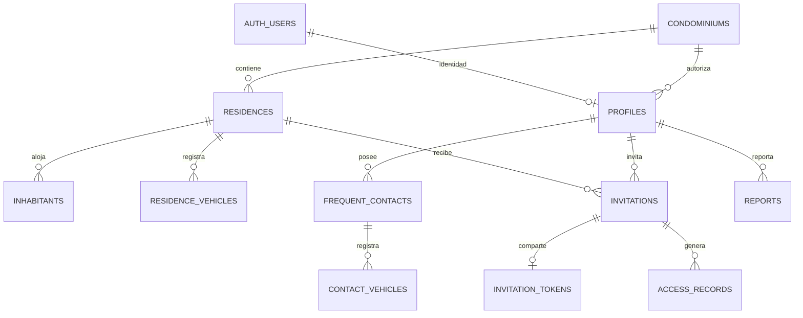

# AccessHome · Plan de backend compartido

## Alcance y resultado de esta etapa

Inspección del 16 de septiembre de 2026. Base encontrada: rama `main`, último commit `aee05be` (`agregar historial de accesos, reportes y dashboards`), árbol de trabajo limpio antes de estos cambios. Etapas 1–7 operativas. No se encontró `.env` de Supabase, SDK, directorio de migraciones, proyecto vinculado ni herramientas `supabase`/`psql` en PATH.

Esta entrega prepara la integración: modelo relacional, migraciones versionadas, políticas de lectura, configuración pública vacía y plan de sustitución de servicios. **La aplicación sigue operando con localStorage; aún no comparte datos entre dispositivos.** No se ejecuta SQL remoto, no se importa ni modifica información existente y no se cambia la autenticación de la aplicación en esta etapa.

Las migraciones dejan toda escritura de clientes bloqueada hasta implementar los RPCs (operaciones de servidor) del Prompt 9 y siguientes. No son una autorización para publicar el prototipo local como backend protegido. Las funcionalidades futuras de guardia/servicios se especifican aquí; sus tablas y flujos se crearán cuando se concrete su alcance.

## 1. Inventario de la aplicación actual

| Área | Archivos / comportamiento encontrado | Consecuencia para la migración |
| --- | --- | --- |
| Frontend | React 19, Vite 8, TypeScript, React Router 7; `components`, `layouts`, `pages`, `services`, `data`, `types`, `hooks`, `utils`, `styles` | Conservar componentes, diseño azul/amarillo, rutas y formularios. No reconstruir. |
| Dependencias | React, Router y `qrcode.react`; sin biblioteca general de UI ni SDK de backend | Añadir solo `@supabase/supabase-js` cuando exista un adaptador que lo utilice. No se instala en esta preparación. |
| Autenticación | `authService` compara correo/contraseña de `DemoAccount`; `AuthProvider` obtiene sesión y escucha eventos | Sustituir la implementación por Auth; `session: { userId }` local no prueba identidad. |
| Permisos | `ProtectedRoute`, `PrincipalRoute`; reglas en `communityRules`, `contactRules`, `invitationRules`, `reportRules`, `accessRules` | Conservar ayudas de UI; trasladar autorización efectiva a RLS/RPC y resolver siempre la cuenta desde el JWT verificado. |
| Modelos | Entidades de comunidad están en `types/demo.ts`; DTOs de contactos, invitaciones, accesos y reportes en archivos propios | Extraer tipos de dominio de `demo.ts` al migrar, sin incorporar tipos del SDK en las pantallas. |
| Persistencia | Solo `demoStorage.ts` accede a `accesshome.demo.v1`, objeto completo de esquema interno 7; migraciones 1–6 y reset | Cada colección pasa a tablas/consultas. Conservar la copia local; no subir el objeto completo desde el navegador. |
| Comunidad | Admin crea/edita/activa casas y asigna principal; principal administra habitantes/vehículos propios | Dos conjuntos de operaciones con autorización distinta. Cuenta adicional activa mantiene consulta. |
| Contactos | Agenda privada por `ownerUserId`; vehículos anidados separados de los permanentes | Dos tablas relacionadas, acceso exclusivo del propietario que siga siendo principal. |
| Invitaciones | Snapshot de visitante, teléfono, vehículo, casa y anfitrión; 0/2 usos; token mediante `generateId()` | Copias y destino calculados en servidor. No usar el fallback aleatorio del navegador como secreto público. |
| Público | `publicInvitationService` proyecta datos mínimos por token y añade vehículo una sola vez, antes de entrada | Sustituir por endpoints limitados; nunca descargar la base local/equivalente para filtrar en React. |
| Accesos | `accessService.validateToken` comprueba estado/fecha/casa/usos, guarda uso+registro en un único `setItem` | Debe ser una transacción con bloqueo por invitación, tiempo servidor e idempotencia. localStorage no coordina puestos. |
| Reportes / dashboards | Servicios calculan totales reales; reportes privados por autor; admin avanza estados | Consultas/agregados del servidor con el mismo alcance. El polling actual cada segundo no debe descargar tablas completas. |
| Actualizaciones | Eventos locales y `storage`; `useCommunityQuery` depende de `communityService.subscribe` | Adaptar suscripciones al proveedor; invalidación tras escribir y refetch al recuperar conexión/foco. |
| Documentación / regresión | README, STATUS, TESTING y contratos en `services/README.md`; 115 pruebas de servicios | Conservar regresión local; añadir pruebas de Auth, RLS, transacciones y dos dispositivos. |

### Compartido frente a local

**Compartir:** identidades y roles, condominios, casas/asignaciones, habitantes, vehículos permanentes, contactos y sus vehículos, invitaciones/tokens, accesos, reportes y, cuando se implementen, autorizaciones de acceso de servicios y reportes de guardia. Los contadores se derivan de estas tablas; no duplicar totales como autoridad local.

**Puede continuar local:** menú abierto/cerrado, filtros visuales, tamaño de página, preferencias de presentación, estado de formularios sin enviar y dibujo del QR a partir del enlace recibido. Actualmente buena parte de esto ya vive en estado de React; no hace falta moverlo a otra persistencia. Evitar persistir borradores con datos personales por defecto.

La sesión administrada por el SDK puede conservar tokens de Auth en el dispositivo para mantener login. Eso no convierte a localStorage en una fuente de permisos. Cerrar sesión debe limpiar cachés de datos protegidos y suscripciones, también al cambiar de cuenta. La copia demo queda separada y no se sincroniza automáticamente.

## 2. Correspondencia con tablas

Esquema `accesshome`: tablas de dominio, para exponer explícitamente mediante Data API después de revisar RLS. Esquema `accesshome_private`: secretos y funciones internas, **no incluir entre esquemas expuestos**. `auth.users` pertenece a Supabase Auth.

| Entidad actual | Tabla preparada | Campos / transformación |
| --- | --- | --- |
| `DemoAccount` / `SessionUser` | `auth.users` + `accesshome.profiles` | Auth guarda identidad y credenciales. Perfil: `user_id`, `display_name`, rol, condominio, casa opcional, activo. No tabla de contraseñas ni copia del correo de login. |
| `Condominium` | `condominiums` | ID, nombre, dirección; añade zona horaria del condominio. |
| `Residence` | `residences` | Condominio, número entero, nombre derivado, calle, activo, `principal_user_id`. |
| `Inhabitant` | `inhabitants` | Casa/condominio, vínculo opcional con Auth, nombre/apellido/contacto/relación/estado. No requiere cuenta. |
| `Vehicle` | `residence_vehicles` | Casa, propietario habitante opcional, placas normalizadas, marca/modelo/color/estado. |
| `FrequentContact` | `frequent_contacts` | Propietario cuenta, condominio, nombre/contacto/notas/estado. Agenda privada incluso frente al admin. |
| `ContactVehicle` | `contact_vehicles` | Contacto, placas obligatorias y datos opcionales. No concede acceso permanente. |
| `Invitation` | `invitations` | Casa/invitador/contacto opcional, snapshots, fechas, estado, usos. Vehículo opcional en columnas, convertido a `VisitVehicle` en el adaptador. |
| `Invitation.token` | `accesshome_private.invitation_tokens` | Relación 1:1; token aleatorio de 32 bytes representado por 64 caracteres hex, único. Separado de las consultas generales. |
| `AccessRecord` | `access_records` | Snapshots, entrada/salida, QR, fecha, autorizado. Añade operador, `request_id` y origen integrado/importado. |
| `Report` | `reports` | Autor/casa/condominio, snapshots de nombres, título/categoría/descripción/estado/fechas. |
| Futuro acceso de servicio | **Planificada:** `service_accesses` | Condominio, destino opcional, proveedor/persona, propósito, autorización/ventana temporal, creador y estado. Pendiente distinguir servicio común o contratado por una casa antes de fijar campos/RLS. |
| Futuro reporte de guardia | **Planificada:** `guard_reports` | Condominio, guardia autor, incidente/categoría/descripción, fecha, estado y acceso relacionado opcional. Privado de operación; no mezclar con reportes residentes. |

No se crea `service_accesses` ni `guard_reports` solo para llenarlas con campos arbitrarios. El rol `guard` sí existe en SQL. Su alcance operativo está reservado y bloqueado hasta sus RPCs. No se añade aún un tercer perfil al router local.

## 3. Relaciones e integridad



- UUID de servidor para nuevas entidades; los `string` actuales permiten mapearlos sin reescribir pantallas. IDs locales como `house-24` requieren un mapa de importación; no son UUID. Un ID de negocio jamás debe conferir acceso.
- Perfil residente asignado a exactamente una casa del mismo condominio; admin y guardia tienen `residence_id = null`. Se conserva el modelo de un condominio por cuenta. Si se necesita pertenencia múltiple, introducir membresías en otra migración, no roles libres en el cliente.
- La FK compuesta del principal comprueba cuenta/casa/condominio. El vínculo opcional de habitante también exige esa misma casa. Los RPCs de asignación comprobarán que el habitante esté activo y crearán sus relaciones en una transacción.
- Claves compuestas impiden vehículos con dueño de otra casa e invitaciones/accesos/reportes cruzados de condominio. Placas permanentes únicas por condominio; placas de contacto únicas dentro del contacto.
- Snapshots de casa, anfitrión y vehículo no se reconstruyen desde registros editables. Borrar contacto debe desvincular `contact_id` de sus invitaciones y borrar sus vehículos en una transacción, conservando snapshots. Las FK no realizan borrados en cascada de historia.
- `max_uses = 2`; contador entre 0 y 2; Completada equivale a 2 usos. Unicidad de `(invitation_id, direction)` evita movimientos duplicados. Esto acompaña al bloqueo transaccional, no lo sustituye.
- Fechas `timestamptz`, reloj del servidor. Propuesta integrada: Hoy y reportes diarios usan la zona horaria del condominio (inicial America/Mexico_City), 24 horas es duración exacta. Antes de cambiar zona, validar que exista en `pg_timezone_names`. La demo local conserva su hora de dispositivo hasta migrar.
- Cuentas con historia se desactivan, no se borran ni trasladan arbitrariamente entre casas. El borrado de una cuenta Auth con referencias queda bloqueado; no borrar usuarios para reiniciar la presentación.

## 4. Permisos y RLS

Supabase distingue el rol PostgreSQL `anon` de una identidad creada mediante anonymous sign-in. El visitante de AccessHome usa una capacidad por token sin cuenta; anonymous sign-in permanecerá desactivado. RLS y privilegios de tabla son controles complementarios. [RLS de Supabase](https://supabase.com/docs/guides/database/postgres/row-level-security)

### Matriz objetivo (se habilita por operación en próximas migraciones)

| Recurso | Administrador | Residente principal | Adicional con cuenta | Guardia | Visitante sin sesión |
| --- | --- | --- | --- | --- | --- |
| Perfil/rol/casa asignada | Consulta condominio; asignación controlada en servidor | Consulta propio; no cambia rol/casa | Igual | Consulta propio | Ninguno |
| Condominio/casas | Gestiona estructura y principal | Consulta su casa | Consulta su casa | Solo contexto mínimo operativo por RPC | Solo nombre destino en proyección |
| Habitantes/vehículos permanentes | Consulta de su condominio | Gestiona su casa activa | Consulta su casa | Sin tablas completas | Ninguno |
| Contactos/vehículos contacto | Ninguno | Solo agenda propia mientras sea principal; casa inactiva en consulta | Ninguno | Ninguno | Ninguno |
| Invitaciones | Consulta operativa; no crea como residente | Crea/cancela para su casa activa; consulta casa | Consulta casa | Validación y datos mínimos por RPC | Solo invitación de su token |
| Accesos | Valida y consulta condominio | Consulta casa/invitaciones | Consulta casa/invitaciones | Valida y recibe resultado mínimo; consulta operativa acotada cuando se defina | Ninguno |
| Reportes residentes | Consulta condominio y avanza estados | Crea para su casa activa, consulta propios | Conserva consulta de reportes propios históricos | Ninguno | Ninguno |
| Accesos de servicios (futuro) | Gestiona autorizaciones comunes | Solo los de su casa si se autoriza ese flujo | Sin gestión | Valida autorización vigente | Ninguno salvo capacidad específica futura |
| Reportes guardia (futuro) | Consulta/gestiona del condominio | Ninguno por defecto | Ninguno | Crea y consulta propios; alcance extra por definir | Ninguno |

### Qué habilita realmente el SQL de esta entrega

- Diez tablas de dominio y una tabla privada de tokens con RLS activado en la misma transacción que las crea; se revocan privilegios de `PUBLIC`, `anon` y `authenticated` antes de abrir lecturas.
- Diez políticas SELECT: admin limitado al condominio; residentes a su casa; reportes además al autor; agenda solo al propietario principal. Guardia solo puede leer su perfil y datos básicos de su condominio. Ninguna tabla admite lectura anónima.
- Cero permisos INSERT/UPDATE/DELETE de clientes y cero RPCs públicos de escritura. Ni el admin autenticado puede todavía escribir en esas tablas. Proveer un JWT por sí solo no da acceso sin un perfil activo vinculado; para residentes también se exige habitante activo.
- Funciones auxiliares privadas con `security definer`, `search_path` vacío, referencias calificadas y ejecución revocada a `PUBLIC`/`anon`. Su propietario debe ser el rol de migración controlado. Solo responden sobre la identidad de `auth.uid()`, no un ID de usuario proporcionado por el cliente. No exponer `accesshome_private` en Data API.
- El esquema no ofrece un endpoint que retorne tokens. El RPC de detalle propio los recuperará únicamente tras verificar la residencia, permitiendo volver a mostrar el mismo QR. Los tokens son secretos de capacidad: no registrar URL completa en analítica/logs y usar `Referrer-Policy: no-referrer` en la futura página pública.

En el Prompt 9, cada operación nueva debe incluir autorización explícita, permisos de ejecución y pruebas. Un RPC `security definer` puede atravesar RLS: no basta con que las tablas la tengan habilitada. No otorgar escritura genérica a todos los autenticados para desbloquear pantallas. Las vistas/agregados deberán respetar RLS (`security_invoker`) o aplicar el mismo alcance dentro del RPC; no exponer agregados globales a residentes. [Funciones de base de datos](https://supabase.com/docs/guides/database/functions)

### Frontera pública por token

Contratos propuestos, aún no implementados:

1. `get_public_invitation(token)` devuelve solo visitante, nombres de casa/anfitrión, vigencia, vehículo/placas, estado, usos y `canAddVehicle`. Sin IDs de cuentas/casas/contactos, teléfonos, correos, notas, listas ni historial. No acepta filtros/listados.
2. `add_public_invitation_vehicle(token, vehicle)` bloquea la fila y verifica activa, casa activa, sin vehículo y sin usos; placas obligatorias. Solo añade vehículo a esa invitación, una vez.
3. Ejecutables para visitante sin cuenta y para usuario autenticado que abre el mismo enlace. El acceso se limita por el token, no por convertir al visitante en usuario Auth.
4. Preferir una Edge Function pública con límites de frecuencia y una función SQL interna ejecutable solo por ese servidor. Si se limita frecuencia en Edge, no conceder a `anon` ejecución directa del RPC subyacente: permitiría saltarse ese control. La clave privilegiada queda solo en servidor y cada rama revalida token; no aceptar rol o casa del request como autoridad. CORS no sustituye autorización. Errores de token inválido no revelan otras entidades. Una alternativa con RPC anónimo directo requeriría aplicar también límites de abuso en esa misma ruta, antes de habilitarla.
5. Token generado mediante CSPRNG del servidor (por ejemplo `gen_random_bytes(32)` de pgcrypto tras comprobar la extensión), nunca el fallback timestamp/Math.random de `generateId`. Guardarlo solo en la tabla privada permite reabrir/compartir el QR. Rotación controlada invalidará el enlace anterior; conservar historia.

## 5. Migración de la capa services

```text
Pantallas y hooks
  → contratos / fachadas actuales de services
    → adaptador local (demo existente)
    → adaptador Supabase (Auth, tablas con RLS, RPCs)
    → futura implementación HTTP para Django
```

Las pantallas seguirán recibiendo DTOs como `ResidenceDetails`, `Invitation`, `PublicInvitation` y `AccessResult`. Conversión snake_case/camelCase, fechas, `null`/cadena vacía y error del SDK pertenece al adaptador. La sesión devuelve correo desde Auth, no desde una consulta pública de perfiles. `primaryResident` no debe exponer correo de login de otras cuentas: reducir ese DTO a ID/nombre al migrar si no es necesario.

| Servicio actual | Implementación compartida prevista |
| --- | --- |
| `authService` | `signInWithPassword`, sesión del SDK, perfil actual y `onAuthStateChange`; logout limpia datos protegidos. |
| `communityService` | Lecturas con RLS, paginación y filtros; RPCs admin para estructura/activación. |
| `principalService` | RPC de asignación de cuenta existente; provisionar cuenta Auth requiere endpoint administrativo con verificación de admin/condominio. Nunca `auth.admin` desde navegador. |
| `householdService` | Operaciones con allowlist de campos; comprobar principal/casa activa y pertenencia de propietario en servidor. |
| `contactsService` | Consultas privadas; altas/ediciones/bajas propias; eliminación relacionada en transacción. |
| `invitationsService` | RPC crea snapshot, destino, vigencia, token y usos; guardado opcional de contacto dentro de la misma transacción. Cancelación controlada. |
| `publicInvitationService` | Dos endpoints de proyección y vehículo público descritos arriba. Sin login ni SELECT directo. |
| `accessService` | RPC `validate_access(token, request_id)` admin/guardia; resultado mínimo y registro atómico. |
| `accessHistoryService` | Consulta del alcance permitido, búsqueda/filtros/paginación y fechas convertidas a límites del condominio. |
| `reportsService` | Crear desde identidad/casa; RPC de estado que solo permite siguiente paso; sin edición de contenido. |
| `dashboardService` | Agregados por condominio/casa y autor, últimos cinco movimientos; no descargar toda la base. |
| `demoService`, `demoStorage`, migraciones locales | Solo proveedor local/importador explícito. Reset demo jamás debe borrar el backend. |

### Validación atómica de accesos

El RPC debe autenticar operador activo y rol admin/guardia; obtener la invitación por token dentro de su condominio; bloquearla con `SELECT … FOR UPDATE`. Tras obtener el bloqueo, volver a consultar reloj real servidor (`clock_timestamp()`) y revalidar periodo, estado, casa y usos. La cancelación y el agregado público de placas deben bloquear la misma fila.

`request_id` se genera una vez por intento y se reutiliza si hay un reintento de red. Bajo el bloqueo, comprobar si ese request ya generó un registro para esa misma invitación/operador: devolver el resultado existente sin consumir otra vez. Un request asociado a otra invitación/operador debe rechazarse, sin revelar su registro. Dos intentos nuevos concurrentes se serializan; producen como máximo Entrada y Salida, nunca un tercer acceso. UI debe evitar doble envío accidental y distinguir reintento de una validación nueva.

Primera aceptación: insertar Entrada y actualizar contador a 1. Segunda: insertar Salida, contador 2, Completada. Cualquier fallo revierte ambos cambios. Los clientes no insertan registros ni cambian contador/estado directamente. Los rechazos no generan movimiento; el operador puede recibir motivo. Para público inválido, respuesta genérica.

### Orden de implementación y cambio de proveedor

1. **Prompt 9:** configurar proyecto, validar migraciones/RLS, provisionar cuentas y datos mínimos, implementar Auth + perfil/guardia + selección explícita de proveedor y contratos. Extraer modelos de dominio y desacoplar `useCommunityQuery` de `communityService.subscribe` hacia las notificaciones del proveedor.
2. Migrar comunidad/asignación y gestión cotidiana; después contactos y reportes. Añadir pruebas de cada RPC antes de habilitar su grant.
3. Migrar invitaciones, endpoint público y control de accesos como una unidad: todos deben usar el mismo backend para que el QR funcione en otro teléfono.
4. Migrar historial/dashboards y sincronización; habilitar Realtime solo en tablas/canales necesarios con el alcance probado, o refetch periódico acotado. Revocar suscripciones al logout/cambio de cuenta. No publicar tokens ni datos de agenda por canales globales.
5. Añadir módulo guardia/accesos de servicios cuando se solicite, mediante nuevas migraciones y contratos.

El modo integrado no puede recurrir silenciosamente a demo si faltan claves, falla Auth, hay un error de red o falta un adaptador. Debe mostrar indisponibilidad y bloquear acciones no migradas. Tampoco mezclar una sesión Supabase con escrituras en la casa local. El modo demo debe ser explícito y separado; el build integrado deberá excluir credenciales/ayudas/reset demo del acceso operativo. Hasta ese cambio, `.env.example` solo documenta configuración reservada, no activa un backend.

Para Django: reemplazar adaptadores por HTTP y obtener sesión/permisos del servidor; mantener DTOs y semántica de operaciones. UUID, relaciones y snapshots son transportables. Las FK a `auth.users`, `auth.uid`, RLS y callbacks Auth necesitarán una migración de identidad/autorización: sustituir Supabase no será solo cambiar una URL, pero no exige rehacer las pantallas.

## 6. Autenticación y provisionamiento

- Email/contraseña de **Supabase Auth**. No importar `DemoAccount.password`, no reutilizar `Access123` como contraseña publicada ni confiar en `session.userId` local.
- `profiles.user_id` referencia el ID de `auth.users`; roles permitidos `admin`, `resident`, `guard`, mostrados como administrador/residente/guardia. Rol/casa/condominio no se derivan de `user_metadata` editable ni de campos enviados por el formulario. La base resuelve autorización actual en cada consulta.
- Cerrar registro público y anonymous sign-in para este prototipo. Aprovisionar el primer admin mediante Dashboard/operación de servidor controlada. Crear cuentas sin perfil no les da acceso a tablas. No hay trigger que convierta cualquier signup en residente/admin.
- Primer lote: crear condominio y residencias sin principal; crear usuarios Auth; insertar perfiles con IDs reales; crear habitantes vinculados; asignar principales. La asignación de una cuenta Auth nueva y SQL no es una única transacción: si falla la relación, la cuenta queda sin permisos y debe poder completarse de forma idempotente por administración.
- Baja de perfil/habitante bloquea datos de inmediato mediante RLS aunque un JWT siga vigente. Al cambiar principal, el anterior conserva consulta de su casa; pierde gestión/agenda. Probar sesiones abiertas durante estos cambios.
- Frontend recibe únicamente Project URL y clave **publishable**. Las claves secretas y `service_role` omiten RLS y pertenecen exclusivamente a procesos confiables de servidor. No guardarlas en variables `VITE_*`. [Claves API](https://supabase.com/docs/guides/getting-started/api-keys)

## 7. Datos demo y conservación

La semilla local actual contiene siete cuentas, cuatro casas (12/24/37/51), ocho habitantes y cinco vehículos permanentes. Daniel es principal de Casa 24; Andrea/Carlos no tienen Auth. Contactos demo de Daniel: Carlos López, María González y Pedro Ramírez. Invitaciones/accesos/reportes empiezan vacíos. Una instalación migrada puede tener más registros; no reemplazarla por esas cantidades.

Se proponen dos caminos independientes para después, sin ejecución automática:

1. **Semilla compartida nueva:** usar nombres ficticios de Los Robles, mantener Daniel/Casa 24, cuentas admin/residente/guardia provisionadas en Auth con contraseñas únicas controladas por el usuario. Agregar otro residente de Casa 12 para aislamiento. Los correos `.demo` actuales no reciben confirmaciones: usar direcciones controladas o aprovisionamiento administrativo explícito para la presentación. No sembrar `auth.users` con hashes/credenciales inventados desde SQL.
2. **Importación de datos existentes:** exportación explícita y copia de respaldo local, validación del esquema 7, vista previa de cantidades/conflictos, mapa `(lote, entidad, legacy_id) → UUID`. Asociar cuentas a IDs Auth reales sin copiar contraseñas/sesión. Importador exclusivo de servidor, repetible sin duplicados; nunca tratar todo JSON del navegador como datos autorizados.

Importar en orden condominio/casas → perfiles/habitantes/principales → vehículos → contactos/vehículos contacto → invitaciones → accesos/reportes. Revisar límites de campos, normalización de placas y FK antes de escribir; un conflicto bloquea ese lote con explicación, no trunca ni descarta datos. Usar transacción para el lote de dominio. Respetar bajas y contactos eliminados; `contact_id` puede quedar nulo conservando snapshot.

Los accesos locales no identifican al operador. Al importar, `source = local_import`, `validated_by = null`, `request_id = null`; conservar fecha/snapshot y no inventar auditoría. Para accesos integrados, ambos campos nuevos son obligatorios. No atribuir fechas antiguas al servidor actual.

Los tokens locales pueden provenir de un fallback no criptográfico: no publicarlos automáticamente. Preservar invitaciones históricas y copias locales; proponer reemisión explícita de enlaces para invitaciones aún vigentes mediante nuevos tokens seguros. Una invitación importada sin token compartible debe mostrarse como histórica, sin generar QR vacío; añadir esa disponibilidad al DTO/adaptador al implementar el importador. Los QR locales previos no pasan a funcionar en Internet por sí solos. Nada elimina ni reinicia `accesshome.demo.v1`.

## 8. Pruebas y criterios de aceptación

### En esta entrega

- `npm run build` y las 115 pruebas locales deben seguir pasando; no hay cambios de rutas ni funcionalidad.
- Revisión estática de SQL: tablas/FK, grants, RLS, ausencia de secretos reales/credenciales seed y escrituras anónimas. `supabase/tests/security_baseline.sql` permite auditar posteriormente el catálogo en una transacción de solo lectura.
- **SQL, RLS y Auth no verificados en una instancia:** no hay proyecto configurado ni PostgreSQL local. Build de Vite no valida SQL. No declarar lista para Internet esta base hasta ejecutar las pruebas siguientes.

### Antes de habilitar cada adaptador integrado

1. Reproducir migraciones en un proyecto de ensayo vacío, auditar catálogo y registrar versiones. Ejecutar consultas con clave publishable + JWT real de cada actor; no probar RLS como `postgres` o `service_role`, que la eluden.
2. Dos condominios, dos casas por condominio, dos principales, una cuenta adicional, guardia y admin. Probar SELECT y mutaciones permitidas y denegadas por cada recurso, también IDs adivinados, filtros, joins, agregados y llamadas REST/RPC directas.
3. Anónimo: cero tablas/perfiles/historial; token válido solo proyección de una visita. Token inválido, excesivamente largo o rotado, sin filtraciones. No se crea una identidad Auth al abrir QR.
4. JWT ausente/expirado, perfil ausente/inactivo, habitante inactivo, guardia de otro condominio, intento de cambiar rol/casa/propietario: denegar. Modificar metadata del usuario no cambia privilegios. Casa inactiva conserva consulta pero bloquea gestión/validación.
5. Contactos privados aun entre habitantes de Casa 24 y frente al admin. Reportes privados por autor; admin avanza estados y no puede saltarlos. Invitaciones y accesos de otra casa nunca aparecen en dashboard/historial residente.
6. Dos puestos validan simultáneamente; petición repetida por timeout; tercera validación; cancelar mientras se valida; agregar placas mientras entra; fechas límite con reloj del cliente alterado. Máximo dos registros, sin contador separado del movimiento ni doble consumo por reintento.
7. Teléfono A residente crea, teléfono B visitante abre QR sin login, puesto C guardia valida; A ve el cambio después de refetch. No depender del mismo origen/perfil/localStorage. Probar fallo de red, recuperación y logout sin datos del usuario anterior.
8. Importar lote de ensayo dos veces, errores de FK/duplicados, snapshots después de editar/borrar contacto, baja de cuenta con historia. Respaldos originales conservados y errores sin pérdida de datos.
9. Revisar bundle y peticiones: solo URL/clave publishable, sin contraseñas demo operativas, claves de servidor, tablas privadas ni tokens de otras casas. Rutas públicas con HTTPS, sin URL de invitación en logs/Referer. Configurar límites de llamadas públicas antes de compartir el enlace por Internet.

## 9. Limitaciones y decisiones pendientes

- No hay aún cliente Supabase, selector de proveedor, migración efectiva de Auth/services, RPCs públicos, transacciones operativas, importador, Realtime ni panel guardia. No se agregaron dependencias, Docker ni Django.
- SQL base es aditivo para esquemas nuevos y no incluye `DROP`, `TRUNCATE` ni seeds destructivos. Si los esquemas ya existen, detenerse y reconciliar; no esconder conflictos con `IF NOT EXISTS`. Aplicar cada archivo una sola vez mediante historial de migraciones.
- Un condominio por cuenta y una casa por residente. No se resuelven traslados/membresías múltiples ni eliminación de identidades con historial en esta etapa.
- El endpoint público, protección frente a abuso, auditoría de asignaciones, recuperación de cuenta, política de retención y provisión operativa de guardias deben completarse antes de usar datos reales. Las pruebas deben usar datos ficticios.
- Tablas/roles/RLS no reemplazan los RPCs: en esta base las lecturas están preparadas y las escrituras permanecen cerradas. No habilitar permisos generales para intentar usarla con los componentes todavía locales.

## 10. Configuración manual antes del Prompt 9

1. Crear o elegir un proyecto Supabase **de ensayo**, identificar organización/región/proyecto y conservar su contraseña de base de datos fuera del repositorio. Si tiene datos, hacer respaldo y revisar su esquema antes de aplicar SQL. No se ha creado ni seleccionado ningún proyecto desde este trabajo.
2. Obtener Project URL y clave publishable desde el Dashboard del proyecto real. Copiar `.env.example` a `.env.local` y completar sus dos valores; está ignorado por Git. No compartir aquí secretos administrativos. La app actual seguirá local hasta implementar el adaptador.
3. En Auth, habilitar email/contraseña, desactivar registro abierto y anonymous sign-in. Configurar confirmación/cuentas de ensayo mediante el Dashboard; definir un correo controlado para admin, residente de Casa 24 y guardia, con contraseñas distintas. Las opciones están descritas en [configuración Auth](https://supabase.com/docs/guides/auth/general-configuration).
4. Configurar Site URL y redirects exactos del frontend que se vaya a usar. Para desarrollo ya existe `http://127.0.0.1:5173`; para Internet debe usarse el dominio HTTPS real, todavía no proporcionado. El callback de confirmación/recuperación se implementará en Prompt 9; no configurar URLs de ejemplo como si fueran reales. [URLs de Auth](https://supabase.com/docs/guides/auth/redirect-urls)
5. Preparar ejecución ordenada de las migraciones según [supabase/README.md](../supabase/README.md). Es válido esperar al Prompt 9 para aplicarlas con el proyecto ya configurado. Si se ejecutan ahora manualmente, registrar resultado de cada archivo; no ejecutar `db reset` remoto ni cargar la demo completa por SQL Editor.
6. Después de aplicar/verificar RLS, incluir solo `accesshome` como esquema de aplicación expuesto en Data API. Nunca exponer `accesshome_private` ni `auth`. Mantener el resto de la configuración del proyecto sin cambios indiscriminados. No añadir tablas a publicaciones Realtime hasta configurar su alcance en la integración.
7. Anotar IDs Auth reales de las cuentas creadas y la asignación deseada. El bootstrap de perfiles/casas/principales debe hacerlo el migrador o un endpoint confiable; ninguna cuenta puede autoasignarse admin. No hace falta pegar contraseñas al chat.

**Para comenzar el Prompt 9 basta con el proyecto de ensayo identificado, `.env.local` con sus dos valores públicos, método de acceso/correos de prueba definidos y confirmación de si ya se aplicó alguna migración.** Los secretos de servidor permanecerán en el entorno confiable cuando se necesiten para provisionar cuentas. No se requieren para el frontend ni para ejecutar `npm run build`.

Las migraciones se versionan como SQL en `supabase/migrations`; el historial debe mantenerse alineado con el proyecto elegido. [Migraciones Supabase](https://supabase.com/docs/guides/deployment/database-migrations)
